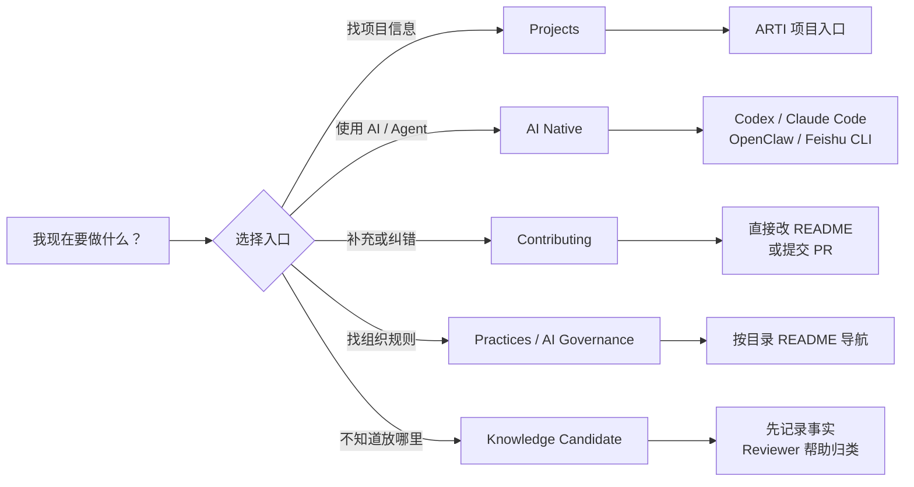
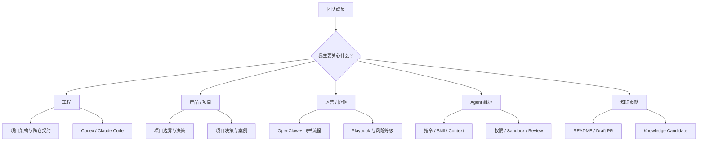
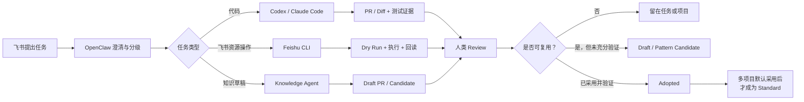
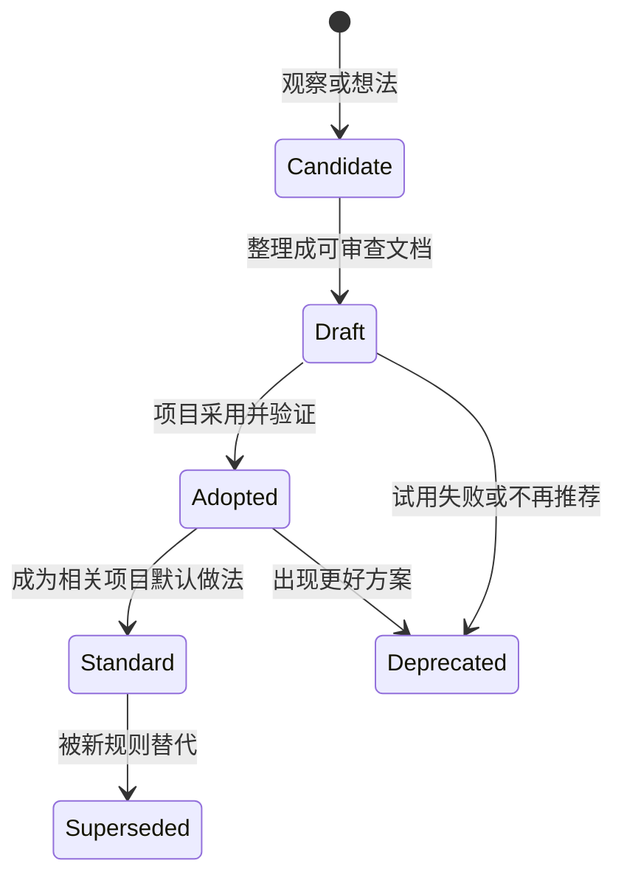
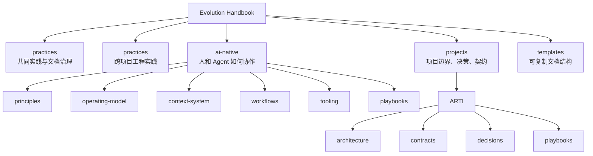

# Evolution Handbook

团队共同维护的协作手册。这里沉淀跨项目长期有效的实践、项目契约和 AI Native 工作方式。

它主要服务两类协作：

- **同事之间协作**：快速知道项目边界、真源、决策、契约和贡献方式。
- **人和 Agent 协作**：让 Agent 能按同一套路查上下文、判断风险、执行验证、留下可复用结果。

> 第一次来不需要先理解全部目录。先找到与你当前任务有关的入口，边使用边补充。

## 30 秒上手

| 你现在想做 | 从这里开始 |
|---|---|
| 第一次来，不知道先读什么 | [Onboarding Quickstart](ONBOARDING.md) |
| 了解 ARTI | [ARTI 项目入口](projects/arti/README.md) |
| 在飞书里和 OpenClaw 协作 | [飞书与 OpenClaw 协作](ai-native/workflows/feishu-openclaw-collaboration.md) |
| 使用 Codex、Claude Code 或 Feishu CLI | [AI 工具实践](ai-native/tooling/README.md) |
| 修文档、补案例或提出反例 | [参与贡献](CONTRIBUTING.md) |
| 不知道内容放哪里 | [内容路由](WORKSPACE.md) |
| 判断谁是真源 | [Source of Truth](SOURCE_OF_TRUTH.md) |

## 这个 Handbook 怎么用

- 同事接手任务时，用它快速找到项目入口、Owner、契约和已有决策。
- Agent 开始工作前，用它判断内容层级、真源、权限边界和验证方式。
- 任务结束后，把可复用的做法、反例、契约或案例沉淀回来。
- 文档冲突时，不靠记忆争论，回到 Source of Truth 和真实系统确认。

## 五个约定

无论是同事还是 Agent，先记住这五条，就可以开始参与：

1. **真实系统优先。** 代码、Schema 和可执行资产是实现事实的真源。
2. **从 Draft 开始。** 未验证的想法可以提交，但不能包装成组织 Standard。
3. **Agent 必须验证。** Agent 的“已完成”需要测试、Diff、链接或回读结果支撑。
4. **高风险由人批准。** 发布、权限、结算、生产数据和外部正式消息不能默认自动执行。
5. **任何成员都能改。** README、链接、案例、反例和过期内容都欢迎直接修正。

## AI Native 三条核心主张

| 原则 | 核心判断 | 完整说明 |
|---|---|---|
| End-to-End 对产品负责 | 不只对流程和局部交付负责，要对用户价值与产品结果负责 | [端到端产品责任](ai-native/principles/end-to-end-product-ownership.md) |
| 按 Trait 组队 | Job Family 提供专业基础，Trait 决定团队在不确定环境中的贡献方式 | [按 Trait 组队](ai-native/principles/trait-based-teams.md) |
| Context 就是竞争力 | 工具差距会缩小，Context 的质量、流转和可复用性会持续复利 | [上下文即基础设施](ai-native/principles/context-as-infrastructure.md) |

## 五类关键 Trait

- **Builder / Pirate**：把想法变成现实的人，核心能力是执行力和速度。Pirate 强调想办法尽快达成目的，后续可扩展性和长期债务再交给 Architect 收口。
- **Architect**：让系统可扩展、可维护的人。Builder 做出来的东西可能能跑，Architect 确保它能持续地跑、大规模地跑。
- **Taste Maker**：有审美、有品味的人。在 AI 生成大量内容的时代，负责判断“什么是好的”，确保产品不只是能用，而是好用、想用。
- **Signal Reader**：理解用户需求、能从市场中捕捉信号的人。持续做定量或定性调研，判断我们做的东西是不是市场真正需要的。
- **Decision Maker**：能在不确定性中做决策、不断产生有效 initiative 的人。在信息不完整时做判断，并承担后果。

## 按角色导航

| 角色 | 推荐入口 |
|---|---|
| 工程 | [项目目录](projects/README.md) · [ARTI 架构](projects/arti/architecture.md) · [AI 工具](ai-native/tooling/README.md) |
| 产品 / 项目 | [项目边界](projects/README.md) · [长期决策](projects/arti/decisions/README.md) · [跨仓契约](projects/arti/contracts/README.md) |
| 运营 / 协作 | [OpenClaw 协作](ai-native/workflows/feishu-openclaw-collaboration.md) · [风险等级](ai-native/governance/risk-and-automation-levels.md) |
| Agent 维护 | [Agent System](ai-native/agent-system/README.md) · [Context System](ai-native/context-system/README.md) |
| 所有人 | [贡献指南](CONTRIBUTING.md) · [模板](templates/README.md) |

## 一次协作如何沉淀

这里记录的不只是结论，也记录协作路径。目标是让同事和 Agent 下次遇到类似任务时，不用重新摸索。

下面是从飞书请求到组织知识的完整路径。不是每个任务都需要走到最后。

## 文档状态

看到 `Draft` 不代表团队必须遵守。

| 状态 | 含义 |
|---|---|
| `Draft` / `Pattern Candidate` | 可以讨论和试用，不是组织承诺 |
| `Adopted` | 至少一个项目采用并有证据 |
| `Standard` | 相关项目默认遵守，例外需要说明 |
| `Deprecated` / `Superseded` | 不再推荐或已被替代 |
| `Current` | 当前项目事实或契约快照，不等同于组织 Standard |

## Handbook 地图

详细目录路由保存在 [WORKSPACE.md](WORKSPACE.md)，文档所有权保存在 [SOURCE_OF_TRUTH.md](SOURCE_OF_TRUTH.md)。

## 全员共同维护

这个仓库不是少数维护者的专属空间。任何团队成员都可以：

- 直接更新 README、导航、链接和过期描述
- 补充项目实践、失败经验和真实来源
- 提交案例候选、反例和废弃建议
- 将重复工作整理为 Pattern、Playbook 或模板

不确定归属时，先提交 [Knowledge Candidate](https://github.com/botearn/Evolution-Handbook/issues/new?template=knowledge-candidate.md) 或 Draft PR，不需要预先理解全部架构。

本仓库是公共 Handbook。不要提交密钥、客户数据、内部访问地址、本机路径或未脱敏的私密记录。

完整流程见 [CONTRIBUTING.md](CONTRIBUTING.md)。
