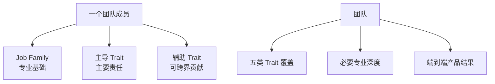

# Trait-Based Team Model

**状态：Draft**

本模型将 [按 Trait 组队](../principles/trait-based-teams.md) 转换为团队盘点和协作方法。

## Trait 不是岗位

一个人的岗位可以是工程师，但主导 Trait 可能是 Architect，也可能是 Builder 或 Taste Maker。

## 团队盘点

每个 Initiative 启动时，填写：

| Trait | 主导成员 | 辅助成员 | 当前缺口 | 验证方式 |
|---|---|---|---|---|
| Builder |  |  |  | 原型或交付周期 |
| Architect |  |  |  | 稳定性、扩展性和债务 |
| Taste Maker |  |  |  | 体验评审和用户反馈 |
| Signal Reader |  |  |  | 研究质量和市场证据 |
| Decision Maker |  |  |  | 决策时效和结果复盘 |

主导成员不是唯一执行者，而是确保该视角不会在关键决策中缺席。

## 产品阶段与 Trait 重心

| 阶段 | 优先 Trait | 常见风险 |
|---|---|---|
| 问题探索 | Signal Reader、Decision Maker | 过早开始实现 |
| 原型验证 | Builder、Taste Maker | 做得快但不可用 |
| 产品化 | Architect、Taste Maker | 原型债务拖垮体验 |
| 增长验证 | Signal Reader、Decision Maker | 指标增长但价值不成立 |
| 规模化 | Architect、Decision Maker | 局部效率损害整体系统 |

重心变化不代表其他 Trait 可以缺席。

## Builder 与 Architect 的协作

速度和可持续性不应变成两个角色互相甩锅。

每次快速实验应明确：

- 哪些是一次性探索代码
- 哪些路径如果验证成功必须重构
- 谁负责产品化
- 重构触发条件和最晚时间
- 哪些安全和数据约束从第一天就不能放松

Architect 不负责无限期清理 Builder 留下的一切；Builder 也要对实验进入生产后的后果负责。

## Review

在 Initiative Review 中增加三个问题：

1. 哪个 Trait 在本轮发挥了关键作用？
2. 哪个 Trait 缺席，造成了什么返工或盲点？
3. 下一阶段需要调整谁的主导责任？

这些记录用于改善组队，不用于给个人贴永久标签。
