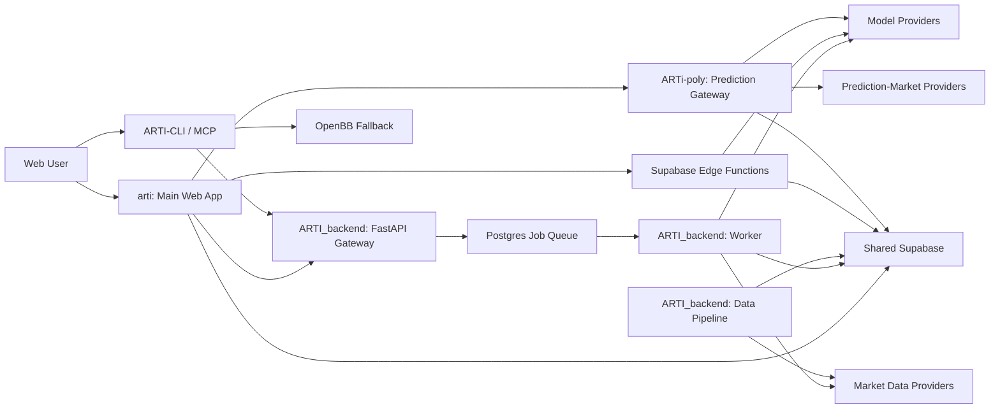

# ARTI Architecture

**状态：Current Snapshot**

**核对日期：2026-06-15**

本文描述项目级边界和进程关系。端点、字段和部署参数以对应仓库代码为准。

## 系统地图



## 运行平面

### 体验平面

`arti` 提供主站、聊天、报告、记忆、Credits 和原生预测市场体验。它是用户导航、前端状态和站内路由的主要所有者。

预测市场 UI 已进入 `arti/src/predict/`。浏览器侧通过同源 `/predict-api` 网关访问 `ARTi-poly` 服务，避免重新引入跨域认证和 CORS 问题。

### 实时计算平面

轻量、低延迟或流式功能仍可能运行于：

- Supabase Edge Functions
- Railway FastAPI Gateway

Edge 到 Railway 的迁移仍在进行。修改前必须从当前调用方和生产入口确认实际 Owner，不能根据历史 RFC 推断。

### 异步计算平面

重型报告采用任务模式：

```text
创建任务
  → report_tasks.status=pending
  → Postgres 队列
  → Worker 标记 processing
  → 分析、圆桌、报告组装
  → result 写回
  → status=done 或 failed
  → DB 触发通知与退款等副作用
```

Worker 的当前生产入口位于 `ARTI_backend/worker/entrypoint.py`，任务定义位于 `shared/arti_shared/queue_tasks.py`。历史 `report-worker/worker.py` 不应作为排障入口。

### 数据平面

共享 Supabase 承担：

- Auth 与用户身份
- 业务表和 RLS
- Credits、预测仓位和交易记录
- `report_tasks` 异步任务状态
- `notifications` 站内通知
- `agent_data` 等共享缓存
- Postgres 队列

多个仓库连接同一业务平面，因此 schema 和 RPC 变更必须有唯一 Owner。

### 数据同步平面

`ARTI_backend` 的 data-pipeline 定时同步市场、基本面、新闻和宏观数据，并写入共享数据层。前端和报告 Worker 通过统一数据层消费，而不是各自建立不可追踪的数据副本。

## 主要请求路径

### 快速诊断

```text
arti UI
  → Edge Function 或 Railway API
  → 市场数据与缓存
  → 模型调用
  → 结构化结果
  → UI 与记忆数据
```

### 深度报告

```text
arti UI
  → ARTI_backend 服务端入口
  → 缓存检查
  → 服务端 Credits 扣费
  → report_tasks + queue
  → Worker
  → report_tasks.result
  → Realtime / 查询 / notification
```

### 预测市场

```text
arti/src/predict
  → /predict-api
  → ARTi-poly gateway
  → shared Supabase RPC
  → market / position / credits result
```

交易预览可以在客户端计算，但成交、扣款和结算必须由服务端锁定状态后重算。

当前预测市场 RPC 仍接受客户端计算的部分经济学字段。服务端权威化是明确目标，但尚未完整落地；修改相关链路时必须把它视为已知完整性风险。

### CLI 与 MCP

```text
ARTI-CLI
  → ARTI_backend HTTP API
  → structured output

部分数据不可用
  → OpenBB fallback
```

CLI 的输出与命令是独立用户契约，不应直接依赖 Web UI 内部类型。

## 稳定不变量

- 重型任务不依赖浏览器保持在线。
- 前端不能成为 AI 扣费或结算的权威执行者。
- 下注与卖出的经济学参数应迁为服务端权威；当前客户端参数仍是已知例外。
- 共享 DB 对象必须有唯一 migration Owner。
- Worker 单个 Analyst 失败不应默认炸掉整个报告。
- 数据无法可靠覆盖时，不静默替换为“最接近”的对象。
- 报告写入必须经过 canonical assembler，读侧负责兼容历史结果。
- 外部副作用必须可去重、可追踪，并在高风险场景保留人工批准。

## 已知过渡区

| 区域 | 当前状态 | 修改前必须确认 |
|---|---|---|
| Edge → Railway | 迁移中 | 真实生产入口与流量比例 |
| Predict UI | 主站已原生收编，独立仓仍存在 | 改的是 UI、gateway 还是兼容部署 |
| Prompt | Backend 与 CLI 有副本 | 哪份由目标运行时实际加载 |
| Report config | 主站与 Backend 各有注册信息 | Agent ID、report type 和 engine 是否一致 |
| Agent rules | 仓库覆盖不一致 | 当前宿主读取哪个规则文件 |

## 实现入口

- 主站：[iloveopt/arti](https://github.com/iloveopt/arti)
- Backend：[botearn/ARTI_backend](https://github.com/botearn/ARTI_backend)
- Prediction Gateway：[botearn/ARTi-poly](https://github.com/botearn/ARTi-poly)
- CLI：[botearn/ARTI-CLI](https://github.com/botearn/ARTI-CLI)
