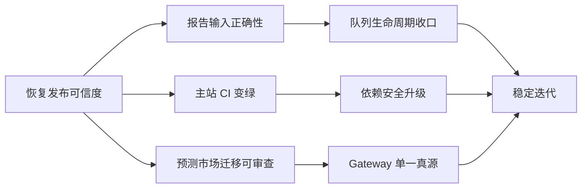

# ARTI Current Status

**状态：Current**

**核对日期：2026-06-15**

这是 ARTI 当前的项目作战面板，回答四个问题：

1. 产品现在是否可以放心发布？
2. 哪些问题正在真实影响用户或系统正确性？
3. 下一步先做什么，做到什么算完成？
4. 哪些旧 TODO 已经过期，不应继续干扰判断？

核对范围：`arti`、`ARTI_backend`、`ARTi-poly`、`ARTI-CLI`。

执行细节、依赖、验收命令和回滚要求见 [ARTI Execution Backlog](execution-backlog.md)。

## 发布姿态

| 动作 | 当前建议 |
|---|---|
| 文档、测试和不触及生产的本地修复 | 可以继续 |
| 单仓低风险 UI 修复 | CI 通过后可以发布 |
| 报告输入、队列和 Prompt 变更 | 需要专项回归 |
| Prediction Gateway 切流 | 需要跨仓发布计划 |
| Credits、结算、RLS、生产 migration | 必须人工审批并先做 dev E2E |

当前不是全面冻结，而是**禁止把未验证的跨仓和资产变更混进普通功能发布**。

发布证据统一按执行账本中的 G1-G5 门禁记录。P0 项目至少需要正确性、可重复构建、数据安全、可观测性和回滚中与其风险相关的全部证据。

## 当前判断

**结论：核心功能可运行，但不建议在没有专项验收的情况下继续扩大改动面。**

| 维度 | 状态 | 判断 |
|---|---|---|
| Web 主站质量门禁 | 阻断 | lint 和测试均未全绿 |
| 报告正确性 | 阻断 | 非法 symbol 可能穿透并被当作美股处理 |
| 报告 Worker 稳定性 | 风险 | 已有告警和部分自愈，但任务生命周期仍有缺口 |
| 预测市场 | 风险 | 主站正在收编能力，独立仓与 Backend 网关副本持续漂移 |
| CLI | 风险 | 可构建，但测试、Prompt 和公开文档存在漂移 |
| 跨仓契约 | 阻断 | Prompt 与 Gateway 尚无自动漂移门禁 |
| 当前迁移工作 | 风险 | `arti` 存在未提交的迁移、Cron 和 Edge Function |



## Top 5

### ARTI-001：拒绝未识别的股票代码

| 字段 | 内容 |
|---|---|
| 优先级 | P0 |
| 类型 | Confirmed bug |
| 仓库 | `ARTI_backend` |
| 建议 Owner | Backend / Report Runtime |
| 用户影响 | 无效输入可能创建昂贵报告任务，并产出空数据或错误市场内容 |
| 当前状态 | 未修复 |

代码当前使用：

```python
resolved_symbol = identity.symbol if identity else normalize_symbol(raw_symbol) or raw_symbol
```

原始输入会兜底绕过拒绝逻辑，后续市场检测又把未知输入默认归为 US。

**完成标准**

- 未识别 symbol 返回 4xx。
- 不创建 `report_tasks`。
- 数据层保留 `UNKNOWN`，不默认 US。
- A 股数据源不可用时不静默 fallback 到 yfinance。
- A/HK/US、中文名称、非法输入用例进入 CI。

### ARTI-002：恢复主站质量门禁

| 字段 | 内容 |
|---|---|
| 优先级 | P0 |
| 类型 | Release blocker |
| 仓库 | `arti` |
| 建议 Owner | Web Platform |
| 用户影响 | PR 无法通过确定性门禁，回归风险持续累积 |
| 当前状态 | 未修复 |

2026-06-15 本地验证：

- `npm run lint`：92 errors、230 warnings。
- `npm run test -- --run`：37 个 suite 通过，3 个 suite 加载失败；503 个断言通过。
- 失败集中在主题模块加载时访问不可用的 `localStorage`。

**完成标准**

- lint error 清零。
- 全部测试 suite 通过。
- 在团队支持的 Node LTS 版本运行 CI。
- warning 建立基线，新代码不得继续扩大。

### ARTI-003：审查预测市场迁移包

| 字段 | 内容 |
|---|---|
| 优先级 | P0 |
| 类型 | Release blocker / Work in progress |
| 仓库 | `arti` |
| 建议 Owner | Predict + Database |
| 用户影响 | 涉及 Credits 结算、通知发送和共享数据库 |
| 当前状态 | 本地未提交 |

当前工作区包含：

- 两个数据库 migration。
- `credits-settle` Edge Function。
- `notification-digest` Edge Function。
- 两个 GitHub Actions Cron。
- 对应 `supabase/config.toml` 修改。

进一步核实发现：结算中的单市场失败和通知摘要中的单用户发送失败，都可能仍返回 HTTP 200；当前 Cron 只检查 HTTP status，业务失败可能不会触发飞书告警。

**完成标准**

- 每个 migration 明确 Owner、前置条件和回滚策略。
- Edge Function 鉴权、幂等和部分失败语义有测试。
- Cron 同时检查 HTTP status 和 JSON 业务状态。
- 单市场结算失败、单用户邮件失败能触发明确告警。
- Cron 具备失败告警和手工 dry run。
- 在 dev 环境完成 migration + function + cron 端到端验证。
- 与 `ARTi-poly` 旧入口明确切换和退役顺序。

### ARTI-004：建立 Gateway 单一真源

| 字段 | 内容 |
|---|---|
| 优先级 | P1 |
| 类型 | Architecture risk |
| 仓库 | `ARTi-poly`、`ARTI_backend` |
| 建议 Owner | Predict Gateway |
| 用户影响 | 同一路由在不同部署入口可能返回不同行为 |
| 当前状态 | 未收口 |

两仓 12 个同名核心模块中有 8 个内容不同。`ARTi-poly` 有较完整单测，Backend 同时保存另一份可部署副本。

**完成标准**

- 明确唯一可编辑真源。
- 另一个仓库只消费生成物或同步产物。
- CI 校验文件 checksum 或行为契约。
- 所有允许差异都有清单、原因和退出条件。

### ARTI-005：收口报告任务生命周期

| 字段 | 内容 |
|---|---|
| 优先级 | P1 |
| 类型 | Reliability debt |
| 仓库 | `ARTI_backend` |
| 建议 Owner | Worker / Queue |
| 用户影响 | 部分僵尸任务可能长期不恢复，迟到 worker 可能覆盖新状态 |
| 当前状态 | 部分能力已实现 |

**完成标准**

- stale processing、orphan pending、legacy defer failed 纳入周期扫描。
- `done` / `failed` 更新增加 `status='processing'` CAS。
- 达复活上限时，同时终结对应队列 job。
- 增加中途僵尸、迟到写入和毒丸任务测试。

## 工作流看板

完整任务卡见 [执行账本](execution-backlog.md)。表内状态表示 2026-06-15 的核对结果，不代表已经分配给具体同事。

### 报告与数据

| ID | 优先级 | 状态 | 项目 |
|---|---|---|---|
| ARTI-001 | P0 | Todo | 非法 symbol fail-open |
| ARTI-005 | P1 | Todo | Worker 周期自愈与终态 CAS |
| ARTI-006 | P1 | Todo | Layer 2 部分失败时的降级语义 |
| ARTI-007 | P1 | Todo | 单份报告 token / 成本硬上限 |
| ARTI-008 | P2 | Todo | 早晚报“应跑未跑”期次对账 |

### Web 与用户体验

| ID | 优先级 | 状态 | 项目 |
|---|---|---|---|
| ARTI-002 | P0 | Todo | lint / test 恢复绿色 |
| ARTI-009 | P1 | Verify | 订阅页约 15 秒 loading 与 RLS 403 |
| ARTI-010 | P1 | Todo | 高危生产依赖升级与回归 |
| ARTI-011 | P2 | Todo | Admin feedback 全历史查询性能 |

### 预测市场

| ID | 优先级 | 状态 | 项目 |
|---|---|---|---|
| ARTI-003 | P0 | In progress | Credits 结算与通知迁移包 |
| ARTI-004 | P1 | Todo | Gateway 单一真源 |
| ARTI-012 | P1 | Todo | `ARTi-poly` AI 分析页下注上限口径 |
| ARTI-013 | P1 | Todo | `ARTi-poly` 测试导入路径失效 |
| ARTI-014 | P2 | Decide | 独立 `ARTi-poly` 的保留范围与退役日期 |

### CLI 与 Agent

| ID | 优先级 | 状态 | 项目 |
|---|---|---|---|
| ARTI-015 | P1 | Todo | CLI Prompt 与 Backend 对账 |
| ARTI-016 | P1 | Todo | CLI 生产依赖安全升级 |
| ARTI-017 | P2 | Todo | README 版本、链接、仓库 metadata 修正 |
| ARTI-018 | P2 | Todo | 6 个空实现研报 UX 验收测试 |
| ARTI-019 | P2 | Todo | 四仓 `AGENTS.md` 与 Agent 规则收口 |

## 建议节奏

### 第一批：恢复可信度

目标：让团队重新相信输入校验、CI 和迁移验收。

1. ARTI-001：非法 symbol fail-open。
2. ARTI-002：主站 lint / test。
3. ARTI-003：预测市场迁移包审查。
4. ARTI-010：主站高危依赖升级。

### 第二批：减少线上不确定性

目标：让任务、Gateway 和 Prompt 不再依赖人工记忆保持一致。

1. ARTI-005：队列生命周期。
2. ARTI-004：Gateway 单一真源。
3. ARTI-015：Prompt 同步门禁。
4. ARTI-009：复现订阅页 RLS 403。

### 第三批：清理长期摩擦

目标：降低新同事和 Agent 的理解成本。

1. 修复 CLI 与 Poly 文档、测试和 metadata。
2. 明确 `ARTi-poly` 的长期角色。
3. 收口各仓 Agent 指令。
4. 把活跃任务迁入正式 issue 或项目看板。

## 不要重复追的旧 TODO

以下内容已经由代码核实，不应继续按开放 bug 分配：

- Backend 已实现队列深度飞书告警。
- `report_config` lockdown migration 已删除宽松写策略并增加审计表。
- CLI browser login 使用 `device_code`，与主站和 `cli-auth` Edge Function 一致；当前失败的是旧测试仍断言 `code`。
- 主站 `arti` 已按 `balance + consumable` 计算 AI 分析页下注上限；旧实现仍存在于独立 `ARTi-poly`。
- `ARTi-poly` 的 account、BetPanel 和 QuickBetPanel 已接入 `consumable`，RFC 未勾选项已过期。

## 验证证据

| 仓库 | 命令 | 结果 |
|---|---|---|
| `arti` | `npm run lint` | 失败：92 errors、230 warnings |
| `arti` | `npm run test -- --run` | 失败：37 suite 通过、3 suite 失败；503 tests 通过 |
| `arti` | `npm audit --omit=dev` | 4 high、1 moderate |
| `ARTi-poly` | `npm run build` | 通过 |
| `ARTi-poly` | `npm test` | 失败：11 suite 通过、1 suite 导入失败；68 tests 通过 |
| `ARTi-poly` | `npm audit --omit=dev` | 2 moderate |
| `ARTI-CLI` | `npm run build` | 通过 |
| `ARTI-CLI` | `npm test` | 失败：14 suite 通过、1 test 失败；48 tests 通过 |
| `ARTI-CLI` | `npm audit --omit=dev` | 1 high、4 moderate |
| `ARTI_backend` | 队列与 worker pytest | 未运行：本机没有已安装的 pytest 环境 |

测试环境为 Node `v26.3.0`。主站的 `localStorage` 失败还需在团队正式支持的 Node LTS 环境复核。

## 维护规则

- 本页只保留当前仍值得行动的事项。
- 新问题必须写明证据、影响和完成标准。
- 只在文档里出现、未由代码或运行结果确认的问题标记为 `Verify`。
- 完成项移入变更记录，不长期堆在活跃看板。
- 每周或重要发布前更新一次核对日期和 Top 5。
- 任务被认领后，在执行账本补 Assignee、issue / PR 和目标日期。
