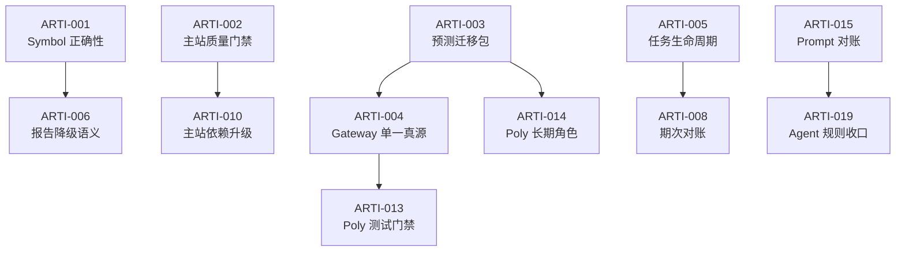

# ARTI Execution Backlog

**状态：Current**

**核对日期：2026-06-15**

本文是 [ARTI 当前状态与行动看板](current-todos-and-bugs.md) 的执行层。状态页负责回答“先做什么”，本文负责回答“如何认领、如何验证、何时算完成”。

## 使用方式

### 状态定义

| 状态 | 含义 |
|---|---|
| `Confirmed` | 已由代码、测试或运行结果确认 |
| `Verify` | 有可信线索，但需要稳定复现后才能定修复方案 |
| `In progress` | 已有本地或分支改动，尚未形成可发布交付 |
| `Decide` | 需要先确定 Owner、目标架构或产品取舍 |
| `Blocked` | 外部依赖未满足，当前不能安全推进 |
| `Done` | 完成标准和验证均已满足 |

### 优先级定义

| 优先级 | 判定 |
|---|---|
| P0 | 影响数据正确性、资产安全、发布可信度或高成本关键路径 |
| P1 | 影响可靠性、用户体验或跨仓一致性，继续拖延会扩大返工 |
| P2 | 维护性、文档和长期摩擦，不阻断当前核心路径 |

### 认领规则

每项任务认领后补充：

- `Assignee`
- 对应 issue / RFC / PR
- 目标完成日期
- 实际验证证据

“建议 Owner”是责任域，不代表已经分配给具体同事。

### Definition of Ready

开始编码前至少满足：

- 已确认真实生产入口。
- 已找到契约 Owner 和主要消费者。
- 已明确是否涉及共享数据库、Credits、权限或外部副作用。
- 已写出可失败的测试或稳定复现步骤。
- 跨仓改动已确定主篇和发布顺序。

### Definition of Done

- 代码与文档完成。
- 目标仓库测试通过。
- 失败、重试和历史兼容路径已覆盖。
- 需要时完成 dev / staging E2E。
- 发布和回滚步骤明确。
- 状态页、契约或相关 RFC 已回写。

## 依赖关系



## 发布门禁

跨仓、生产或资产相关改动至少通过以下门禁：

| Gate | 问题 | 通过证据 |
|---|---|---|
| G1 正确性 | 正常、非法和边界输入是否符合契约？ | 单测、契约测试 |
| G2 可重复构建 | 团队支持环境能否稳定 lint、test、build？ | CI 绿色 |
| G3 数据安全 | migration 是否可重跑，资产操作是否幂等？ | dev migration + 重跑记录 |
| G4 可观测性 | 业务失败是否能让任务失败并触发告警？ | 故障注入、告警回读 |
| G5 可回滚性 | 新旧入口、Schema 和 Cron 如何撤回？ | 发布顺序、回滚步骤 |

P0 任务不能只凭“代码已写”关闭，必须给出对应 Gate 证据。

## 任务索引

`证据状态` 表示问题是否核实，`执行状态` 表示修复工作是否开始。`Confirmed` 不等于已完成。

| ID | P | 证据状态 | 执行状态 | 建议 Owner | Assignee | Tracking | 目标日期 |
|---|---|---|---|---|---|---|---|
| ARTI-001 | P0 | Confirmed | Todo | Backend / Report Runtime | 未认领 | 待创建 | 待排期 |
| ARTI-002 | P0 | Confirmed | Todo | Web Platform | 未认领 | 待创建 | 待排期 |
| ARTI-003 | P0 | Confirmed | In progress | Predict + Database | 待确认 | 待关联 | 待确认 |
| ARTI-004 | P1 | Confirmed | Todo | Predict Gateway | 未认领 | 待创建 | 待排期 |
| ARTI-005 | P1 | Confirmed | Todo | Worker / Queue | 未认领 | 待创建 | 待排期 |
| ARTI-006 | P1 | Confirmed | Todo | Report Runtime + Product | 未认领 | 待创建 | 待排期 |
| ARTI-007 | P1 | Confirmed | Todo | AI Runtime / FinOps | 未认领 | 待创建 | 待排期 |
| ARTI-008 | P2 | Confirmed | Todo | Brief / Operations | 未认领 | 待创建 | 待排期 |
| ARTI-009 | P1 | Verify | Investigate | Web + Supabase | 未认领 | 待创建 | 待排期 |
| ARTI-010 | P1 | Confirmed | Todo | Web Platform / Security | 未认领 | 待创建 | 待排期 |
| ARTI-011 | P2 | Confirmed | Todo | Admin Platform | 未认领 | 待创建 | 待排期 |
| ARTI-012 | P1 | Confirmed | Todo | Predict Web | 未认领 | 待创建 | 待排期 |
| ARTI-013 | P1 | Confirmed | Todo | Predict Gateway | 未认领 | 待创建 | 待排期 |
| ARTI-014 | P2 | Confirmed | Decide | Product + Architecture | 未认领 | 待创建 | 待排期 |
| ARTI-015 | P1 | Confirmed | Todo | Report Runtime + CLI | 未认领 | 待创建 | 待排期 |
| ARTI-016 | P1 | Confirmed | Todo | CLI / Security | 未认领 | 待创建 | 待排期 |
| ARTI-017 | P2 | Confirmed | Todo | CLI | 未认领 | 待创建 | 待排期 |
| ARTI-018 | P2 | Confirmed | Todo | CLI | 未认领 | 待创建 | 待排期 |
| ARTI-019 | P2 | Confirmed | Todo | Developer Experience | 未认领 | 待创建 | 待排期 |

## ARTI-001

**拒绝未识别的股票代码**

| 字段 | 内容 |
|---|---|
| 优先级 | P0 |
| 证据状态 | Confirmed |
| 执行状态 | Todo |
| 建议 Owner | Backend / Report Runtime |
| 仓库 | `ARTI_backend` |
| 主要路径 | `/v1/generate-report`、报告数据上下文 |

**证据**

- `apps/api/handlers/report_handler.py` 两处使用 `normalize_symbol(raw_symbol) or raw_symbol`。
- `modules/market/services/stock_context_service.py` 的 `_detect_market()` 对未知输入默认返回 `US`。
- A 股 Tushare 不可用时会静默调用 yfinance。

**故障模式**

未识别输入可以创建报告任务，随后被当作美股取数。最坏结果不是“报错”，而是消耗额度和模型成本后返回看似完成但没有可靠数据的报告。

**实施范围**

1. 报告创建和相关重试入口统一调用 canonical resolver。
2. 未识别输入返回 4xx，不写 `report_tasks`。
3. 市场识别保留 `UNKNOWN` 或显式异常。
4. A 股数据源不可用时返回 source error，不跨市场 fallback。
5. 下游能区分“标的无数据”和“数据源故障”。

**非目标**

- 本任务不重写全部股票搜索体验。
- 不要求一次统一 Web 和 Python 的 resolver 实现。

**验收**

- `AAPL`、`0700.HK`、`600519.SS` 和合法中文名称正常。
- `GDP`、随机字符串和无法解析的中文输入返回 4xx。
- 非法输入不会创建任务或发生扣费。
- 缺少 `TUSHARE_TOKEN` 时 A 股请求显式失败或带错误标记。

**建议测试**

```bash
python -m pytest apps/api/tests/test_generate_report_endpoint.py
python -m pytest shared/tests/test_stock_resolver.py
```

## ARTI-002

**恢复主站质量门禁**

| 字段 | 内容 |
|---|---|
| 优先级 | P0 |
| 证据状态 | Confirmed |
| 执行状态 | Todo |
| 建议 Owner | Web Platform |
| 仓库 | `arti` |

**证据**

- `npm run lint`：92 errors、230 warnings。
- `npm run test -- --run`：3 个 suite 在加载主题模块时失败。
- 当前测试环境 Node `v26.3.0`，项目没有明确团队 Node LTS 版本。

**拆分**

### ARTI-002A：测试运行时

- 在 Node 20 / 22 LTS 复跑，判断是否为 Node 26 与 jsdom 组合问题。
- 测试 setup 提供稳定的 `localStorage`。
- `use-theme.ts` 使用可检测的存储访问，不在模块加载时假设全局可用。

### ARTI-002B：lint error

- 先按规则分类：`no-explicit-any`、空 block、Hook dependency。
- 优先修预测市场和报告关键路径。
- warning 先建立基线，不把“大函数重构”混入本次修复。

### ARTI-002C：CI 版本与门禁

- 在 `package.json`、版本文件或 CI 中声明支持的 Node 版本。
- CI 至少执行 lint、unit test 和 production build。

**验收**

```bash
npm run lint
npm run test
npm run build
```

三条命令在团队支持的 Node LTS 环境均为绿色。

## ARTI-003

**审查并发布预测市场迁移包**

| 字段 | 内容 |
|---|---|
| 优先级 | P0 |
| 证据状态 | Confirmed |
| 执行状态 | In progress |
| 建议 Owner | Predict + Database |
| 仓库 | `arti`、`ARTi-poly` |
| 风险 | Credits、结算、通知、共享数据库、定时任务 |

**当前资产**

- `20260529120000_predict_market_base_tables.sql`
- `20260615120000_predict_market_ops_backfill.sql`
- `credits-settle` Edge Function
- `notification-digest` Edge Function
- 两个 GitHub Actions Cron
- `supabase/config.toml` function 配置

**新增核实风险**

1. `credits-settle` 只有所有顶层 RPC 都报错时才返回 500；部分步骤失败仍可能返回 HTTP 200。
2. `scan_settled_markets()` 把单市场失败放在 `errors` 数组中，同时仍返回 `success: true`，当前 Function 不会把它识别为失败。
3. `notification-digest` 即使部分邮件发送结果为 `failed`，仍返回 `{ success: true }` 和 HTTP 200。
4. 两个 Cron 只检查 HTTP status，因此上述业务失败不会触发失败步骤和飞书告警。

**实施拆分**

### ARTI-003A：Schema 所有权

- 对照生产 schema，而不是只对照仓库 migration 历史。
- 确认 `CREATE TABLE IF NOT EXISTS` 遇到旧表时不会遗漏新列、约束和索引。
- 明确 `credits_markets`、`credits_positions`、`market_data`、`events` 和通知表的 migration Owner。
- 核对已有 `settle_market` 定义，避免旧版本覆盖新通知语义。

### ARTI-003B：Function 鉴权

- 保留 `verify_jwt=false` 时，代码内鉴权必须有负例测试。
- 不在日志和响应中泄漏 service role、Cron secret 或 admin key。
- 明确 GET 是否确有必要；无必要则仅允许 POST。

### ARTI-003C：业务失败传播

- RPC 返回嵌套 `errors` 时，Function 应返回非 2xx 或统一的失败状态。
- Digest 出现发送失败时，响应需要给 Cron 可判定的失败信号。
- Cron 同时检查 HTTP status 和 JSON `success`。
- 飞书告警包含失败步骤、数量和运行链接，不包含用户邮箱等敏感信息。

### ARTI-003D：幂等与重跑

- 重复执行 settlement 不重复发放或释放 Credits。
- Digest delivery log 防止重复发送。
- migration 和 backfill 在已存在部分对象的数据库中可安全重跑。

### ARTI-003E：切换与退役

- 记录旧 `ARTi-poly` Cron 的关闭时间。
- 先部署新 Function，再启用新 Cron，最后关闭旧入口。
- 保留单次回滚窗口，避免新旧 Cron 同时运行。

**验收**

- dev 数据库从干净状态和“已有旧对象”状态各跑一次 migration。
- 未授权请求返回 401/403。
- 人工制造一个市场结算失败，Workflow 必须失败并告警。
- 人工制造一封邮件发送失败，Workflow 必须失败或进入明确的 partial failure 告警。
- 连续触发两次 Cron 不产生重复资产变更或重复邮件。

**发布要求**

此任务涉及用户资产和生产定时任务，部署、密钥和生产 migration 需要人类明确批准。

## ARTI-004

**建立 Prediction Gateway 单一真源**

| 字段 | 内容 |
|---|---|
| 优先级 | P1 |
| 证据状态 | Confirmed |
| 执行状态 | Todo |
| 建议 Owner | Predict Gateway |
| 仓库 | `ARTi-poly`、`ARTI_backend` |

**证据**

两仓 12 个同名 `_lib` 核心模块中有 8 个内容不同；只有 `ai-cache.js`、`calibration.js`、`kalshi-auth.js` 和 `metrics.js` 当前一致。

**决策点**

- `ARTi-poly/api/` 是否继续是真源。
- Backend 副本是临时部署产物，还是未来真源。
- 主站 `/predict-api` 当前真实指向哪个部署。

**推荐路径**

短期先确定一个可编辑真源，并加 checksum / diff CI。中期再选择 package、生成脚本、subtree 或独立 gateway 仓库。

**验收**

- Owner、消费者和部署目标写入 `source-of-truth.md`。
- 同名文件漂移会让 CI 失败。
- 允许差异有 allowlist、原因、Owner 和删除日期。
- 两个入口跑同一组 contract tests。

## ARTI-005

**收口报告任务生命周期**

| 字段 | 内容 |
|---|---|
| 优先级 | P1 |
| 证据状态 | Confirmed |
| 执行状态 | Todo |
| 建议 Owner | Worker / Queue |
| 仓库 | `ARTI_backend` |

**证据**

- stale processing、orphan pending、legacy defer failed 只在 worker 启动扫描。
- `mark_report_task_done()` 和 `mark_report_task_failed()` 没有 `status='processing'` 守卫。
- report task 有复活上限，但队列 job 仍可能继续回到 todo。

**实施范围**

- 三类恢复进入周期 monitor，并保持多 worker 幂等。
- 终态写入使用 CAS，返回是否成功。
- 迟到 worker 写入失败时记录结构化日志，不覆盖新任务状态。
- 达复活上限时同步终结对应 job。

**验收**

```bash
python -m pytest shared/tests/test_queue.py
python -m pytest shared/tests/test_worker_entrypoint.py
```

增加中途僵尸、迟到完成、迟到失败和毒丸任务用例。

## ARTI-006

**定义 Layer 2 部分失败降级语义**

| 字段 | 内容 |
|---|---|
| 优先级 | P1 |
| 证据状态 | Confirmed |
| 执行状态 | Todo |
| 建议 Owner | Report Runtime + Product |
| 仓库 | `ARTI_backend`、`arti` |

**问题**

大师调用部分超时或失败时，当前缺少统一产品语义：继续合成、整单失败，还是展示 Layer 1 降级结果。

**需要决策**

- 最少成功大师数量。
- 哪些失败可重试。
- 用户看到的状态、错误和降级提示。
- `report_tasks` 最终状态与 Credits 是否退款。
- 已生成 Layer 1 内容是否保留。

**验收**

- 决策写入报告契约或 RFC。
- 0、部分、全部 Layer 2 失败均有测试。
- Web 能明确区分完整报告、降级报告和失败报告。
- Billing 与通知行为和最终状态一致。

## ARTI-007

**增加单份报告 token 与成本硬上限**

| 字段 | 内容 |
|---|---|
| 优先级 | P1 |
| 证据状态 | Confirmed |
| 执行状态 | Todo |
| 建议 Owner | AI Runtime / FinOps |
| 仓库 | `ARTI_backend` |

**问题**

当前有并发和缓存优化计划，但缺少单任务累计 token / 成本断路器。异常 symbol、超长上下文或 Prompt 注入可能造成不可控调用。

**实施范围**

- 在统一 AI Gateway 累计本次报告的输入、输出和缓存 token。
- 配置软告警和硬上限。
- 断路后写入可识别错误，不继续后续 Agent。
- 记录模型、阶段、token 和估算成本。

**验收**

- 正常报告不受影响。
- 构造超限任务会停止后续调用。
- 用户、任务状态、退款和飞书告警语义一致。
- 上限可配置，但生产不能默认为无限。

## ARTI-008

**增加早晚报期次对账**

| 字段 | 内容 |
|---|---|
| 优先级 | P2 |
| 证据状态 | Confirmed |
| 执行状态 | Todo |
| 建议 Owner | Brief / Operations |
| 仓库 | `ARTI_backend` |

**问题**

`tg_push_records` 只记录已经进入生成流程的任务。Cron 根本未启动时没有业务记录，仓库内无法发现“应跑未跑”。

**验收**

- 建立工作日 morning / evening 预期期次。
- 超过截止时间仍无记录时告警。
- 节假日和手工补跑不会误报。
- 对账任务自身失败也可被观察。

## ARTI-009

**复现订阅页长 loading 与 RLS 403**

| 字段 | 内容 |
|---|---|
| 优先级 | P1 |
| 证据状态 | Verify |
| 执行状态 | Investigate |
| 建议 Owner | Web + Supabase |
| 仓库 | `arti` |

**已知线索**

RFC 记录订阅页约 15 秒 loading，伴随 `subscribers` RLS 403 和重试。当前 migration 允许用户读取自己的订阅，并限制首次创建为 free。

**先验证，不先改**

- 使用新用户和已有订阅用户各复现一次。
- 保存 network trace、JWT 角色、请求项目和 RLS 错误。
- 检查 React Query 默认 retry 是否放大等待。
- 确认前端连接的 Supabase 项目已应用对应 migration。

**验收**

- 根因能归入 RLS、环境漂移、JWT、自动建行或查询重试之一。
- 修复后首次进入和再次进入均无长时间空转。
- 403 不被静默重试成约 15 秒 loading。

## ARTI-010

**升级主站高危生产依赖**

| 字段 | 内容 |
|---|---|
| 优先级 | P1 |
| 证据状态 | Confirmed |
| 执行状态 | Todo |
| 建议 Owner | Web Platform / Security |
| 仓库 | `arti` |

**证据**

`npm audit --omit=dev` 报告 4 high、1 moderate，涉及 React Router、Lodash 和 WebSocket 依赖树。

**实施原则**

- 先检查 direct dependency 的最小安全版本。
- 不直接执行不可审查的强制大版本升级。
- 和 ARTI-002 一起在 Node LTS 上验证。

**验收**

- 高危生产告警清零，无法升级项有影响分析和临时缓解。
- 回归登录跳转、邀请链接、报告路由、预测市场路由和 realtime。
- 锁文件变化单独可审查。

## ARTI-011

**优化 Admin feedback 历史查询**

| 字段 | 内容 |
|---|---|
| 优先级 | P2 |
| 证据状态 | Confirmed |
| 执行状态 | Todo |
| 建议 Owner | Admin Platform |
| 仓库 | `arti` |

**问题**

`admin-feedback-list` 会加载历史 evaluation cases 后在内存去重。数据增长后会放大延迟、内存和数据库传输。

**验收**

- 去重和分页在数据库侧完成。
- 查询有时间或数量边界。
- 大数据 fixture 下返回顺序和现有 UI 一致。
- 记录查询耗时和行数。

## ARTI-012

**统一独立 Poly 的下注上限口径**

| 字段 | 内容 |
|---|---|
| 优先级 | P1 |
| 证据状态 | Confirmed |
| 执行状态 | Todo |
| 建议 Owner | Predict Web |
| 仓库 | `ARTi-poly` |

**证据**

`src/components/AIAnalysisRunner.tsx` 的历史结果分支仍按 `account.balance * 0.5` 计算；其他下注入口使用 `balance + consumable`。

**验收**

- 所有下注入口使用同一 `available` helper。
- 只有 `consumable` 的新用户不会被错误拦截。
- 服务端仍重新校验，不以客户端计算为权威。
- 增加 account 组合测试。

## ARTI-013

**修复 Poly 失效测试入口**

| 字段 | 内容 |
|---|---|
| 优先级 | P1 |
| 证据状态 | Confirmed |
| 执行状态 | Todo |
| 建议 Owner | Predict Gateway |
| 仓库 | `ARTi-poly` |

**证据**

`api/_lib/_predict-market-scan.test.js` 从同目录导入不存在的 `./predict-market-scan.js`，导致整个 suite 在收集阶段失败。

**验收**

- 测试导入真实 handler。
- `npm test` 全绿。
- 测试不是只验证 mock 自身，至少覆盖一次 close time 或 upsert 行为。
- 若该 handler 已退役，删除测试前先删除或迁移对应生产入口。

## ARTI-014

**决定独立 ARTi-poly 的长期角色**

| 字段 | 内容 |
|---|---|
| 优先级 | P2 |
| 证据状态 | Confirmed |
| 执行状态 | Decide |
| 建议 Owner | Product + Architecture |
| 仓库 | `arti`、`ARTi-poly` |

**需要回答**

- 独立 Web 是否仍对用户开放。
- Gateway 是否继续由该仓维护。
- 哪些 Cron、migration 和 UI 已迁入主站。
- 退役、兼容或长期双部署的成本。

**输出**

- 一页 Architecture Decision。
- 保留能力清单和退役清单。
- Owner、日期、流量切换和回滚方案。

## ARTI-015

**建立 Backend → CLI Prompt 对账**

| 字段 | 内容 |
|---|---|
| 优先级 | P1 |
| 证据状态 | Confirmed |
| 执行状态 | Todo |
| 建议 Owner | Report Runtime + CLI |
| 仓库 | `ARTI_backend`、`ARTI-CLI` |

**证据**

- `_common.yaml`、全部 Layer 1 和两个 synthesizer 文件不同。
- CLI 缺少 `innovation_evangelist.yaml`。
- CLI 同步文档仍描述 7 位大师。

**推荐方案**

- Backend Prompt 是报告语义真源。
- CLI 需要差异时使用显式 overlay，而不是整文件复制后自由漂移。
- CI 输出新增、删除、内容变化和 allowlist 差异。

**验收**

- 有一条可重复的同步或对账命令。
- 未批准漂移会让 CI 失败。
- 第 8 位大师和 registry 一致。
- CLI 报告关键 golden cases 与 Backend 对齐。

## ARTI-016

**升级 CLI 高危生产依赖**

| 字段 | 内容 |
|---|---|
| 优先级 | P1 |
| 证据状态 | Confirmed |
| 执行状态 | Todo |
| 建议 Owner | CLI / Security |
| 仓库 | `ARTI-CLI` |

**证据**

`npm audit --omit=dev` 报告 1 high、4 moderate，涉及 URI、Hono、限流和查询解析依赖。

**验收**

- 高危生产告警清零或有明确不可利用证明。
- MCP Server、Backend HTTP、鉴权和限流测试通过。
- 恶意 URI、Authorization scheme 和超大请求至少有一组安全回归。

## ARTI-017

**修正 CLI 公开文档和 package metadata**

| 字段 | 内容 |
|---|---|
| 优先级 | P2 |
| 证据状态 | Confirmed |
| 执行状态 | Todo |
| 建议 Owner | CLI |
| 仓库 | `ARTI-CLI` |

**已确认问题**

- README badge 为 `0.2.0-beta`，package version 为 `0.3.4`。
- repository / homepage 指向旧 Owner。
- README 含 `/Users/nicolechen/...` 本机绝对路径。
- 顶部仍以 OpenBB 驱动描述产品，和 Backend-first 现状不一致。

**验收**

- 公开链接从 GitHub 页面可访问。
- package metadata 指向当前仓库。
- 数据源和 fallback 描述与代码一致。
- README 不含本机绝对路径、内部地址或秘密示例。

## ARTI-018

**把研报 UX 验收测试变成真实门禁**

| 字段 | 内容 |
|---|---|
| 优先级 | P2 |
| 证据状态 | Confirmed |
| 执行状态 | Todo |
| 建议 Owner | CLI |
| 仓库 | `ARTI-CLI` |

**证据**

`tests/test_ac_research_ux.py` 的 6 个测试只有 TODO 和 `pass`，且不在 `npm test` 中运行。

**决策**

- 能用 Vitest 验证的交互逻辑迁到 TypeScript 测试。
- 需要真实终端或 E2E 的场景单独标记，不伪装成已通过单测。

**验收**

- 每项需求至少有一个会失败的断言。
- 测试进入 CI 或明确的 E2E job。
- 删除空 `pass` 测试。

## ARTI-019

**收口四仓 Agent 指令**

| 字段 | 内容 |
|---|---|
| 优先级 | P2 |
| 证据状态 | Confirmed |
| 执行状态 | Todo |
| 建议 Owner | Developer Experience |
| 仓库 | 四个仓库 |

**问题**

- Backend 与 CLI 缺平台无关 `AGENTS.md`。
- `arti` 与 `ARTi-poly` 的 Agent 规则存在重复、通用模板和命名漂移。
- 不同 Agent 宿主可能读取不同文件。

**实施原则**

- 仓库事实只有一个短小真源。
- `CLAUDE.md` 等宿主文件通过 bridge 引用，不复制整套规则。
- 生产入口、测试命令、权限和禁止事项写在代码附近。

**验收**

- 四仓都有清晰的 Agent 入口。
- 不同宿主读取后得到一致的关键规则。
- 删除过期模型名、旧生产入口和冲突分支说明。

## 更新记录

| 日期 | 变化 |
|---|---|
| 2026-06-15 | 建立 19 项执行卡；补充迁移 Cron 业务失败无法触发告警的风险 |
